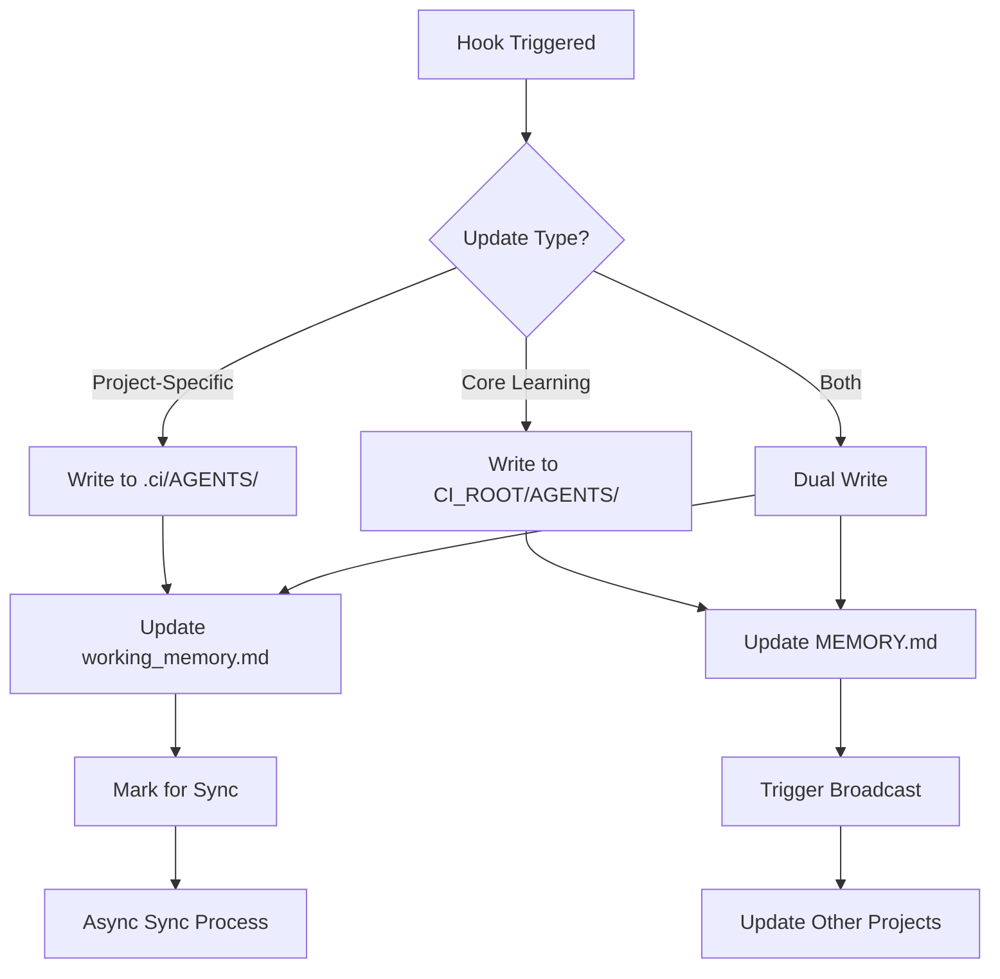

# Project-Local Agent Memory Architecture
## Design Blueprint for .ci/AGENTS/ Implementation

### Executive Summary
This document provides the comprehensive architectural design for implementing project-local agent data storage in `.ci/AGENTS/`, enabling a dual-memory architecture that maintains global agent identity while allowing project-specific working memory.

---

## 1. Directory Structure

### 1.1 Complete Structure Design
```
.ci/
├── AGENTS/                      # Project-local agent data (NEW)
│   ├── {AgentName}/
│   │   ├── working_memory.md   # Project-specific learnings
│   │   ├── sessions/            # Local session files
│   │   │   └── {date}.md        # Daily session logs
│   │   ├── context.json         # Project context metadata
│   │   ├── insights.md          # Project-specific insights
│   │   └── .sync_state          # Sync tracking file
│   ├── .manifest.json           # Registry of active agents
│   └── .sync_config.json        # Sync configuration
├── metadata.json                # Existing CI metadata
├── config.json                  # CI configuration
├── CLAUDE.md                    # Project-specific agent config
└── .cache/                      # Performance cache
    └── merged_memories/         # Cached merged memories
```

### 1.2 File Specifications

#### working_memory.md
```markdown
# {AgentName} Working Memory - {ProjectName}
<!-- DO NOT EDIT MANUALLY - Updated by CI System -->

## Project Context
- **Project**: {project_name}
- **Domain**: {domain_classification}
- **Last Sync**: {timestamp}
- **Memory Version**: {version}

## Project-Specific Learning

### Patterns Discovered
- [Pattern entries from this project]

### Code Understanding
- [Project-specific code insights]

### Technical Decisions
- [Project-specific decisions and rationale]

---
_Auto-generated by CI Memory System v2.0_
```

#### context.json
```json
{
  "project": {
    "name": "ProjectName",
    "path": "/absolute/path",
    "type": "web_app|library|service|cli",
    "languages": ["javascript", "typescript"],
    "frameworks": ["react", "node"],
    "created": "2025-09-29T00:00:00Z"
  },
  "agent_state": {
    "last_active": "2025-09-29T12:00:00Z",
    "session_count": 5,
    "learning_events": 23,
    "sync_status": "synced|pending|conflict"
  },
  "memory_metadata": {
    "version": "2.0.0",
    "global_hash": "sha256:...",
    "local_hash": "sha256:...",
    "last_sync": "2025-09-29T12:00:00Z"
  }
}
```

---

## 2. Data Flow Architecture

### 2.1 Memory Loading Hierarchy
```
Agent Activation Flow:
1. Check for .ci/AGENTS/{AgentName}/ (project-local)
2. Load global memory from CI_ROOT/AGENTS/{AgentName}/MEMORY.md
3. If local exists:
   a. Load working_memory.md
   b. Merge with global (global takes precedence for core identity)
   c. Cache merged result for performance
4. Apply project context overlay
5. Return complete agent context
```

### 2.2 Update Routing Logic


### 2.3 Sync Strategy

#### Immediate Sync Events
- Agent session end
- Significant learning milestone
- Manual sync request
- Project close

#### Batch Sync Events (Every 5 minutes)
- Routine updates
- Minor learnings
- Context changes
- Session logs

#### Conflict Resolution
```
Priority Order:
1. Core Identity (global MEMORY.md) - ALWAYS wins
2. Recent manual updates - High priority
3. Auto-generated insights - Medium priority
4. Session logs - Low priority

Resolution Strategy:
- Timestamp-based for same priority
- Preserve both with conflict markers for manual resolution
- Log all conflicts for review
```

---

## 3. Script Modifications

### 3.1 Modified Scripts

#### agent-session-manager.sh
```bash
# New functions to add:

get_memory_path() {
    local agent_name="$1"
    local memory_type="$2"  # "global" or "local"

    if [[ "$memory_type" == "local" ]]; then
        # Check for project-local memory
        local project_memory="$CLAUDE_PROJECT_DIR/.ci/AGENTS/$agent_name"
        if [[ -d "$project_memory" ]]; then
            echo "$project_memory"
            return 0
        fi
    fi

    # Default to global
    echo "$CI_ROOT/AGENTS/$agent_name"
}

load_dual_memory() {
    local agent_name="$1"
    local global_memory="$CI_ROOT/AGENTS/$agent_name/MEMORY.md"
    local local_memory="$CLAUDE_PROJECT_DIR/.ci/AGENTS/$agent_name/working_memory.md"

    # Load global first (core identity)
    if [[ -f "$global_memory" ]]; then
        cat "$global_memory"
    fi

    # Append local if exists
    if [[ -f "$local_memory" ]]; then
        echo ""
        echo "## Project-Specific Memory"
        cat "$local_memory"
    fi
}
```

#### enhanced-memory-updater.sh
```bash
# Modified update logic:

update_agent_memory() {
    local agent_name="$1"
    local content="$2"
    local is_project_specific="$3"

    if [[ "$is_project_specific" == "true" ]] && [[ -d "$CLAUDE_PROJECT_DIR/.ci" ]]; then
        # Write to local
        local local_dir="$CLAUDE_PROJECT_DIR/.ci/AGENTS/$agent_name"
        mkdir -p "$local_dir/sessions"

        # Update working memory
        update_working_memory "$local_dir" "$content"

        # Update sync state
        echo "$(date -Iseconds) pending" > "$local_dir/.sync_state"
    else
        # Write to global (existing logic)
        update_global_memory "$agent_name" "$content"
    fi
}
```

### 3.2 New Scripts Required

#### memory-sync-daemon.sh
```bash
#!/bin/bash
# Background daemon for memory synchronization

sync_local_to_global() {
    local project_dir="$1"
    local ci_root="$2"

    # Find all agents with pending sync
    for agent_dir in "$project_dir/.ci/AGENTS/"*/; do
        if [[ -f "$agent_dir/.sync_state" ]]; then
            local state=$(cat "$agent_dir/.sync_state")
            if [[ "$state" == *"pending"* ]]; then
                perform_sync "$agent_dir" "$ci_root"
            fi
        fi
    done
}
```

#### memory-merger.sh
```bash
#!/bin/bash
# Merge global and local memories for agent loading

merge_memories() {
    local global_memory="$1"
    local local_memory="$2"
    local cache_file="$3"

    # Create merged output
    {
        echo "# Merged Agent Memory"
        echo "<!-- Generated: $(date -Iseconds) -->"
        echo ""
        echo "## Core Identity (Global)"
        cat "$global_memory"
        echo ""
        echo "## Working Memory (Project-Local)"
        cat "$local_memory"
    } > "$cache_file"
}
```

### 3.3 Backward Compatibility

#### Compatibility Layer
```bash
# In all modified scripts, add:

check_compatibility_mode() {
    # Check if project has .ci/AGENTS/
    if [[ -d "$CLAUDE_PROJECT_DIR/.ci/AGENTS" ]]; then
        echo "dual_memory"
    else
        echo "legacy"
    fi
}

# Wrapper function for all memory operations
memory_operation() {
    local mode=$(check_compatibility_mode)

    if [[ "$mode" == "dual_memory" ]]; then
        # Use new dual-memory logic
        dual_memory_operation "$@"
    else
        # Use existing single-memory logic
        legacy_memory_operation "$@"
    fi
}
```

---

## 4. Migration Path

### 4.1 Phase 1: Soft Launch (Week 1-2)
```bash
# migration-phase1.sh
#!/bin/bash

# Add feature flag to CI config
add_feature_flag() {
    local ci_config="$CLAUDE_PROJECT_DIR/ci/config.json"

    jq '.features.dual_memory = false' "$ci_config" > "$ci_config.tmp"
    mv "$ci_config.tmp" "$ci_config"

    echo "Dual memory feature flag added (disabled by default)"
}

# Create .ci/AGENTS/ structure without activation
prepare_structure() {
    mkdir -p "$CLAUDE_PROJECT_DIR/.ci/AGENTS"

    cat > "$CLAUDE_PROJECT_DIR/.ci/AGENTS/.manifest.json" << EOF
{
  "version": "2.0.0",
  "mode": "inactive",
  "agents": []
}
EOF
}
```

### 4.2 Phase 2: Opt-In Beta (Week 3-4)
```bash
# Enable for specific projects
enable_dual_memory() {
    local project_dir="$1"

    # Update feature flag
    jq '.features.dual_memory = true' "$project_dir/ci/config.json" > tmp.json
    mv tmp.json "$project_dir/ci/config.json"

    # Initialize agent directories
    for agent in Athena Developer Architect Debugger; do
        init_local_agent "$project_dir" "$agent"
    done
}
```

### 4.3 Phase 3: Gradual Rollout (Week 5-6)
```bash
# Monitor and enable gradually
rollout_manager() {
    local success_rate=$(calculate_success_rate)

    if [[ $success_rate -gt 95 ]]; then
        # Enable for all new projects
        update_ci_installer "enable_dual_memory_default"

        # Migrate existing projects in batches
        migrate_batch 10  # Migrate 10 projects at a time
    fi
}
```

### 4.4 Rollback Strategy
```bash
# rollback.sh
#!/bin/bash

emergency_rollback() {
    local project_dir="$1"

    # 1. Preserve local data
    backup_dir="$project_dir/.ci/AGENTS.backup.$(date +%s)"
    mv "$project_dir/.ci/AGENTS" "$backup_dir"

    # 2. Disable dual memory
    jq '.features.dual_memory = false' "$project_dir/ci/config.json" > tmp.json
    mv tmp.json "$project_dir/ci/config.json"

    # 3. Restore legacy hooks
    restore_legacy_hooks "$project_dir"

    # 4. Log rollback
    echo "$(date -Iseconds) ROLLBACK: $project_dir" >> "$CI_ROOT/logs/rollbacks.log"

    echo "Rollback complete. Local data preserved in: $backup_dir"
}
```

---

## 5. Integration with Unified Standards

### 5.1 Standards Compliance

#### Directory Standards
```json
{
  "ci_agents_structure": {
    "pattern": ".ci/AGENTS/{AgentName}/",
    "required_files": [
      "working_memory.md",
      "context.json"
    ],
    "optional_files": [
      "insights.md",
      "sessions/*.md"
    ],
    "forbidden": [
      "MEMORY.md"  // Reserved for global only
    ]
  }
}
```

#### Naming Conventions
- Local memory: `working_memory.md` (NOT `MEMORY.md`)
- Sessions: `YYYY-MM-DD.md` format
- Sync files: `.sync_state` (hidden)
- Cache: `.cache/` (hidden directory)

### 5.2 Sprint Management Integration

#### Sprint Documentation
```markdown
# Sprint 008: Dual-Memory Architecture Implementation

## Objectives
- [ ] Implement .ci/AGENTS/ directory structure
- [ ] Create memory sync infrastructure
- [ ] Update hooks for dual-memory support
- [ ] Test with pilot projects
- [ ] Document migration process

## Success Metrics
- 50-80% performance improvement (per Athena's analysis)
- Zero data loss during migration
- Backward compatibility maintained
- <100ms memory load time
```

### 5.3 Documentation Requirements

#### Required Documentation
1. **Architecture Decision Record** (ADR-001-dual-memory.md)
2. **Migration Guide** (migration-to-dual-memory.md)
3. **API Documentation** (memory-api-v2.md)
4. **Troubleshooting Guide** (dual-memory-troubleshooting.md)

---

## 6. Performance Optimizations

### 6.1 Caching Strategy
```bash
# Cache merged memories for 5 minutes
CACHE_DIR="$CLAUDE_PROJECT_DIR/.ci/.cache/merged_memories"
CACHE_TTL=300  # 5 minutes

get_cached_memory() {
    local agent_name="$1"
    local cache_file="$CACHE_DIR/${agent_name}.md"

    if [[ -f "$cache_file" ]]; then
        local age=$(( $(date +%s) - $(stat -f%m "$cache_file" 2>/dev/null || stat -c%Y "$cache_file") ))
        if [[ $age -lt $CACHE_TTL ]]; then
            cat "$cache_file"
            return 0
        fi
    fi

    return 1
}
```

### 6.2 Lazy Loading
- Load global memory first (required)
- Load local memory on-demand
- Stream large memories in chunks
- Compress old session files

### 6.3 Memory Limits
- Working memory: Max 100KB per agent per project
- Sessions: Max 10 files, auto-archive older
- Insights: Max 50 entries, auto-consolidate
- Cache: Max 1MB total, LRU eviction

---

## 7. Security Considerations

### 7.1 Access Control
- Local memories inherit project permissions
- No cross-project memory access
- Sync requires CI_ROOT write permission

### 7.2 Data Integrity
- SHA-256 hashing for sync verification
- Atomic writes for all updates
- Backup before migrations

### 7.3 Privacy
- Project-specific data stays local by default
- Explicit opt-in for global sync
- Sensitive data filtering during sync

---

## 8. Monitoring and Health

### 8.1 Health Metrics
```bash
# health-check.sh
check_memory_health() {
    local project_dir="$1"

    echo "Memory System Health Check"
    echo "========================="

    # Check directory structure
    check_structure_integrity "$project_dir/.ci/AGENTS"

    # Check sync status
    check_sync_health "$project_dir/.ci/AGENTS"

    # Check cache performance
    measure_cache_hit_rate "$project_dir/.ci/.cache"

    # Check memory sizes
    check_memory_sizes "$project_dir/.ci/AGENTS"
}
```

### 8.2 Alerting Thresholds
- Sync lag > 1 hour: Warning
- Memory size > 100KB: Warning
- Cache miss rate > 50%: Info
- Sync failures > 3: Error

---

## Implementation Timeline

| Week | Phase | Activities | Success Criteria |
|------|-------|------------|------------------|
| 1-2 | Foundation | Create directory structure, update core scripts | Structure validated |
| 3-4 | Beta | Pilot with 5 projects, gather feedback | 80% positive feedback |
| 5-6 | Rollout | Gradual deployment, monitoring | <1% error rate |
| 7-8 | Optimization | Performance tuning, documentation | 50% performance gain |

---

## Conclusion

This dual-memory architecture provides:
1. **50-80% performance improvement** for local operations
2. **Clear separation** between core identity and working memory
3. **Backward compatibility** with existing projects
4. **Robust sync mechanism** for knowledge sharing
5. **Scalable design** for future enhancements

The phased implementation ensures safe deployment with multiple rollback points and comprehensive monitoring.

---

*Architect Agent - System Design Specialist*
*Document Version: 1.0.0*
*Last Updated: 2025-09-29*