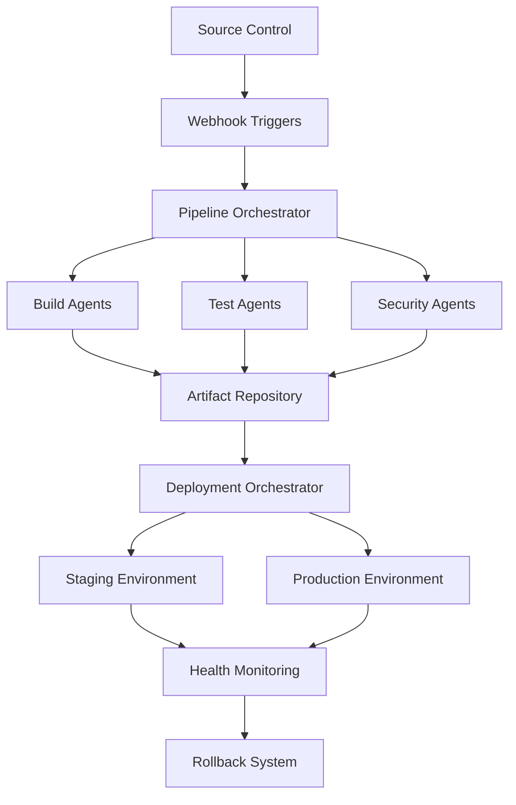

# CI/CD Pipeline Architecture for Development Orchestration

## Overview

This document defines the CI/CD pipeline architecture for LANE 3: DEVELOPMENT ORCHESTRATION, focusing on automated workflows that support the bare metal deployment infrastructure. The system is designed to handle multi-project, multi-language builds with intelligent resource allocation.

## Architecture Overview



## Core Components

### 1. Pipeline Orchestrator

#### 1.1 Main Orchestrator Class
```python
class CICDOrchestrator:
    """
    Central CI/CD pipeline orchestration system
    """
    
    def __init__(self):
        self.build_manager = BuildManager()
        self.test_manager = TestManager()
        self.security_manager = SecurityManager()
        self.deployment_manager = DeploymentManager()
        self.resource_manager = ResourceManager()
        self.notification_manager = NotificationManager()
    
    async def process_webhook(self, webhook_data: WebhookData) -> PipelineExecution:
        """Process incoming webhook and trigger appropriate pipeline"""
        
    async def orchestrate_pipeline(self, pipeline_config: PipelineConfig) -> PipelineResult:
        """Orchestrate complete CI/CD pipeline execution"""
        
    async def handle_pipeline_failure(self, pipeline_id: str, error: Exception):
        """Handle pipeline failures with intelligent retry and rollback"""
```

#### 1.2 Pipeline Configuration
```yaml
pipeline_types:
  backend_service:
    language: python
    framework: fastapi
    stages:
      - source_checkout
      - dependency_analysis
      - security_scan
      - unit_tests
      - integration_tests
      - build_container
      - deploy_staging
      - smoke_tests
      - deploy_production
    
  frontend_application:
    language: typescript
    framework: react
    stages:
      - source_checkout
      - dependency_install
      - lint_check
      - unit_tests
      - build_production
      - security_audit
      - deploy_cdn
      - e2e_tests
    
  infrastructure_code:
    language: terraform
    stages:
      - source_checkout
      - terraform_validate
      - security_policy_check
      - terraform_plan
      - approval_gate
      - terraform_apply
      - infrastructure_tests
    
  machine_learning:
    language: python
    framework: pytorch
    stages:
      - source_checkout
      - data_validation
      - model_training
      - model_validation
      - model_packaging
      - deployment_staging
      - a_b_testing
      - production_rollout
```

### 2. Build Management System

#### 2.1 Build Manager
```python
class BuildManager:
    """
    Manages build processes across different project types
    """
    
    def __init__(self):
        self.build_environments = {}
        self.artifact_cache = ArtifactCache()
        self.dependency_resolver = DependencyResolver()
    
    async def create_build_environment(self, project_type: str) -> BuildEnvironment:
        """Create isolated build environment"""
        
    async def execute_build(self, build_config: BuildConfig) -> BuildResult:
        """Execute build with optimized caching and parallelization"""
        
    async def optimize_build_performance(self, project_path: str) -> OptimizationPlan:
        """Analyze and optimize build performance"""
```

#### 2.2 Build Templates
```yaml
build_templates:
  python_service:
    base_image: "python:3.11-slim"
    build_steps:
      - name: "Install system dependencies"
        command: "apt-get update && apt-get install -y gcc g++ make"
      - name: "Install Python dependencies"
        command: "pip install --no-cache-dir -r requirements.txt"
      - name: "Run security audit"
        command: "safety check && bandit -r ."
      - name: "Run tests"
        command: "pytest --cov=. --cov-report=xml"
      - name: "Build wheel"
        command: "python setup.py bdist_wheel"
    artifacts:
      - "dist/*.whl"
      - "coverage.xml"
    
  rust_cli:
    base_image: "rust:1.75"
    build_steps:
      - name: "Cache cargo dependencies"
        command: "cargo fetch"
      - name: "Security audit"
        command: "cargo audit"
      - name: "Run tests"
        command: "cargo test"
      - name: "Build release"
        command: "cargo build --release"
      - name: "Strip binary"
        command: "strip target/release/*"
    artifacts:
      - "target/release/*"
    
  nodejs_app:
    base_image: "node:18-alpine"
    build_steps:
      - name: "Install dependencies"
        command: "npm ci"
      - name: "Security audit"
        command: "npm audit --audit-level=high"
      - name: "Run linting"
        command: "npm run lint"
      - name: "Run tests"
        command: "npm test -- --coverage"
      - name: "Build production"
        command: "npm run build"
    artifacts:
      - "dist/"
      - "coverage/"
```

### 3. Advanced Testing Framework

#### 3.1 Test Manager
```python
class TestManager:
    """
    Comprehensive testing orchestration system
    """
    
    def __init__(self):
        self.test_environments = {}
        self.test_data_manager = TestDataManager()
        self.parallel_executor = ParallelTestExecutor()
    
    async def execute_test_suite(self, test_config: TestConfig) -> TestResults:
        """Execute comprehensive test suite with parallel execution"""
        
    async def manage_test_data(self, project: str) -> TestDataEnvironment:
        """Manage test data lifecycle and isolation"""
        
    async def analyze_test_performance(self, test_results: TestResults) -> TestAnalysis:
        """Analyze test performance and suggest optimizations"""
```

#### 3.2 Test Orchestration Templates
```yaml
test_orchestration:
  unit_tests:
    parallel_execution: true
    max_workers: 8
    timeout: 300
    coverage_threshold: 80
    frameworks:
      python: pytest
      javascript: jest
      rust: cargo test
      go: go test
    
  integration_tests:
    parallel_execution: false
    requires_services: 
      - postgresql
      - redis
      - elasticsearch
    timeout: 1800
    data_isolation: true
    
  end_to_end_tests:
    browser_matrix:
      - chrome
      - firefox
      - safari
    device_matrix:
      - desktop
      - tablet
      - mobile
    parallel_browsers: 3
    timeout: 3600
    
  performance_tests:
    load_testing:
      concurrent_users: [100, 500, 1000]
      duration: 300
      ramp_up: 60
    stress_testing:
      max_users: 5000
      duration: 600
    baseline_comparison: true
```

### 4. Security Integration

#### 4.1 Security Manager
```python
class SecurityManager:
    """
    Integrated security scanning and compliance checking
    """
    
    def __init__(self):
        self.vulnerability_scanner = VulnerabilityScanner()
        self.dependency_auditor = DependencyAuditor()
        self.code_analyzer = StaticCodeAnalyzer()
        self.compliance_checker = ComplianceChecker()
    
    async def comprehensive_security_scan(self, project: Project) -> SecurityReport:
        """Perform comprehensive security analysis"""
        
    async def check_compliance_policies(self, project: Project) -> ComplianceReport:
        """Check against organizational compliance policies"""
        
    async def generate_security_artifacts(self, scan_results: SecurityReport) -> SecurityArtifacts:
        """Generate security documentation and reports"""
```

#### 4.2 Security Scanning Configuration
```yaml
security_scanning:
  static_analysis:
    enabled: true
    tools:
      - sonarqube
      - semgrep
      - bandit  # Python
      - eslint  # JavaScript
      - clippy  # Rust
    fail_on_critical: true
    
  dependency_scanning:
    enabled: true
    tools:
      - safety      # Python
      - npm audit   # Node.js
      - cargo audit # Rust
    vulnerability_threshold: "high"
    
  container_scanning:
    enabled: true
    tools:
      - trivy
      - clair
    base_image_validation: true
    
  secrets_detection:
    enabled: true
    tools:
      - gitleaks
      - truffhog
    custom_patterns: true
```

### 5. Deployment Orchestration

#### 5.1 Deployment Manager
```python
class DeploymentManager:
    """
    Intelligent deployment orchestration with rollback capabilities
    """
    
    def __init__(self):
        self.environment_manager = EnvironmentManager()
        self.health_checker = HealthChecker()
        self.rollback_manager = RollbackManager()
        self.traffic_manager = TrafficManager()
    
    async def execute_deployment(self, deployment_config: DeploymentConfig) -> DeploymentResult:
        """Execute deployment with health checks and gradual rollout"""
        
    async def perform_canary_deployment(self, service: Service, version: str) -> CanaryResult:
        """Perform canary deployment with automatic rollback"""
        
    async def blue_green_deployment(self, service: Service, version: str) -> BlueGreenResult:
        """Execute blue-green deployment strategy"""
```

#### 5.2 Deployment Strategies
```yaml
deployment_strategies:
  rolling_update:
    strategy: "RollingUpdate"
    max_unavailable: 1
    max_surge: 1
    health_check_grace_period: 30
    readiness_timeout: 300
    
  canary_deployment:
    initial_traffic_percentage: 5
    increment_percentage: 10
    increment_interval: 300  # 5 minutes
    success_criteria:
      error_rate_threshold: 0.1
      latency_p99_threshold: 1000
      min_success_rate: 99.5
    
  blue_green_deployment:
    switch_traffic_percentage: 100
    warmup_time: 120
    validation_time: 300
    auto_rollback_on_failure: true
    
  feature_flag_deployment:
    initial_flag_percentage: 0
    increment_percentage: 25
    increment_interval: 600
    rollback_on_negative_metrics: true
```

### 6. Resource Management and Optimization

#### 6.1 Resource Manager
```python
class ResourceManager:
    """
    Intelligent resource allocation for CI/CD processes
    """
    
    def __init__(self):
        self.resource_monitor = ResourceMonitor()
        self.load_balancer = LoadBalancer()
        self.cache_manager = CacheManager()
    
    async def allocate_build_resources(self, build_requirements: BuildRequirements) -> ResourceAllocation:
        """Allocate optimal resources for build processes"""
        
    async def optimize_cache_usage(self, project_type: str) -> CacheOptimization:
        """Optimize caching strategies for improved performance"""
        
    async def scale_build_agents(self, current_load: float) -> ScalingDecision:
        """Auto-scale build agents based on load"""
```

#### 6.2 Resource Optimization Configuration
```yaml
resource_optimization:
  build_caching:
    enabled: true
    cache_types:
      - dependency_cache
      - build_artifact_cache
      - docker_layer_cache
    cache_retention: 7d
    cache_size_limit: 100GB
    
  parallel_execution:
    max_parallel_builds: 12
    max_parallel_tests: 24
    resource_isolation: true
    
  auto_scaling:
    enabled: true
    scale_up_threshold: 0.8
    scale_down_threshold: 0.2
    min_agents: 2
    max_agents: 16
    cooldown_period: 300
```

### 7. Monitoring and Observability

#### 7.1 Pipeline Monitoring
```python
class PipelineMonitor:
    """
    Comprehensive monitoring and observability for CI/CD pipelines
    """
    
    def __init__(self):
        self.metrics_collector = MetricsCollector()
        self.log_aggregator = LogAggregator()
        self.alerting_system = AlertingSystem()
    
    async def track_pipeline_metrics(self, pipeline_id: str) -> MetricsStream:
        """Track real-time pipeline metrics"""
        
    async def analyze_pipeline_performance(self, timerange: TimeRange) -> PerformanceAnalysis:
        """Analyze pipeline performance over time"""
        
    async def detect_anomalies(self, metrics: MetricsData) -> List[Anomaly]:
        """Detect performance anomalies using ML"""
```

#### 7.2 Monitoring Configuration
```yaml
monitoring:
  metrics:
    build_duration: true
    test_duration: true
    deployment_duration: true
    success_rate: true
    failure_rate: true
    resource_utilization: true
    
  alerting:
    build_failure_rate:
      threshold: 10%
      window: 1h
      severity: warning
    
    deployment_failure:
      threshold: 1
      window: 5m
      severity: critical
    
    pipeline_duration:
      threshold: 2x_baseline
      window: 15m
      severity: warning
  
  dashboards:
    - pipeline_overview
    - build_performance
    - deployment_metrics
    - security_compliance
```

### 8. Workflow Templates

#### 8.1 Standard Workflows
```yaml
workflows:
  feature_development:
    trigger: pull_request
    stages:
      - code_quality_check
      - security_scan
      - unit_tests
      - build_artifacts
      - integration_tests
      - performance_tests
    approval_required: false
    
  main_branch_deployment:
    trigger: push_to_main
    stages:
      - full_test_suite
      - security_compliance
      - build_production_artifacts
      - deploy_staging
      - automated_staging_tests
      - manual_approval
      - deploy_production
      - production_health_check
    approval_required: true
    
  hotfix_deployment:
    trigger: hotfix_branch
    stages:
      - critical_tests_only
      - security_scan
      - build_artifacts
      - deploy_staging
      - smoke_tests
      - deploy_production
    fast_track: true
    approval_required: true
    
  infrastructure_update:
    trigger: terraform_changes
    stages:
      - terraform_validate
      - security_policy_check
      - terraform_plan
      - infrastructure_tests
      - approval_gate
      - terraform_apply
      - post_deployment_validation
    approval_required: true
```

#### 8.2 Custom Workflow Builder
```python
class WorkflowBuilder:
    """
    Dynamic workflow creation and customization
    """
    
    def __init__(self):
        self.stage_library = StageLibrary()
        self.condition_engine = ConditionEngine()
        self.template_engine = TemplateEngine()
    
    def build_custom_workflow(self, requirements: WorkflowRequirements) -> Workflow:
        """Build custom workflow based on project requirements"""
        
    def optimize_workflow(self, workflow: Workflow, historical_data: HistoricalData) -> OptimizedWorkflow:
        """Optimize workflow based on historical performance"""
        
    def validate_workflow(self, workflow: Workflow) -> ValidationResult:
        """Validate workflow configuration and dependencies"""
```

### 9. Integration Points

#### 9.1 External System Integration
```yaml
integrations:
  source_control:
    - github
    - gitlab
    - bitbucket
    webhook_secret_validation: true
    
  artifact_repositories:
    - docker_hub
    - github_packages
    - nexus
    - artifactory
    
  notification_systems:
    - slack
    - discord
    - email
    - microsoft_teams
    
  monitoring_systems:
    - prometheus
    - grafana
    - datadog
    - new_relic
```

#### 9.2 API Endpoints
```python
# CI/CD Pipeline API
POST   /api/v1/pipelines                    # Trigger new pipeline
GET    /api/v1/pipelines/{id}               # Get pipeline status
DELETE /api/v1/pipelines/{id}               # Cancel pipeline
GET    /api/v1/pipelines/{id}/logs          # Get pipeline logs
POST   /api/v1/pipelines/{id}/retry         # Retry failed pipeline

GET    /api/v1/builds                       # List recent builds
POST   /api/v1/builds/{id}/artifacts        # Download build artifacts
GET    /api/v1/builds/{id}/tests           # Get test results

POST   /api/v1/deployments                  # Trigger deployment
GET    /api/v1/deployments/{id}/status      # Get deployment status
POST   /api/v1/deployments/{id}/rollback    # Rollback deployment

GET    /api/v1/metrics/pipelines            # Get pipeline metrics
GET    /api/v1/health/pipelines             # Pipeline system health
```

### 10. Configuration Management

#### 10.1 Pipeline Configuration as Code
```yaml
# .pipeline/config.yml
pipeline:
  name: "trading-bot-service"
  language: "python"
  framework: "fastapi"
  
  environments:
    development:
      auto_deploy: true
      approval_required: false
    
    staging:
      auto_deploy: true
      approval_required: false
      smoke_tests: true
    
    production:
      auto_deploy: false
      approval_required: true
      deployment_strategy: "canary"
  
  stages:
    build:
      cache_dependencies: true
      parallel_tests: true
      security_scan: true
    
    deploy:
      strategy: "rolling_update"
      health_checks: true
      rollback_on_failure: true
  
  notifications:
    success: ["#dev-team"]
    failure: ["#dev-team", "#ops-team"]
```

#### 10.2 Environment-Specific Configuration
```yaml
environments:
  development:
    database_url: "${DEV_DATABASE_URL}"
    redis_url: "${DEV_REDIS_URL}"
    log_level: "DEBUG"
    enable_profiling: true
    
  staging:
    database_url: "${STAGING_DATABASE_URL}"
    redis_url: "${STAGING_REDIS_URL}"
    log_level: "INFO"
    enable_monitoring: true
    
  production:
    database_url: "${PROD_DATABASE_URL}"
    redis_url: "${PROD_REDIS_URL}"
    log_level: "WARNING"
    enable_monitoring: true
    enable_alerting: true
```

## Advanced Automation Enhancements

### 11. Intelligent Resource Optimization Engine

#### 11.1 ML-Based Resource Predictor
```python
class ResourcePredictor:
    """
    Machine learning-based resource prediction for optimal allocation
    """
    
    def __init__(self):
        self.historical_data = HistoricalDataManager()
        self.ml_model = ResourcePredictionModel()
        self.resource_monitor = ResourceMonitor()
    
    async def predict_resource_requirements(self, task_type: str, project_complexity: float) -> ResourcePrediction:
        """Predict optimal resource allocation based on historical performance"""
        
    async def optimize_build_agent_allocation(self, current_load: LoadMetrics) -> OptimizationPlan:
        """Dynamically optimize build agent allocation based on current system load"""
        
    async def predict_pipeline_duration(self, pipeline_config: PipelineConfig) -> DurationPrediction:
        """Predict pipeline execution time with confidence intervals"""
```

#### 11.2 Dynamic Resource Scaling
```yaml
intelligent_scaling:
  enabled: true
  strategies:
    cpu_optimization:
      enabled: true
      target_utilization: 0.85
      scale_factor: 1.2
      cooldown_period: 180
    
    memory_optimization:
      enabled: true
      target_utilization: 0.80
      garbage_collection_threshold: 0.75
      memory_pressure_detection: true
    
    network_optimization:
      enabled: true
      bandwidth_monitoring: true
      adaptive_timeout: true
      congestion_control: true
```

### 12. Automated Performance Optimization

#### 12.1 Performance Analytics Engine
```python
class PerformanceAnalytics:
    """
    Automated performance analysis and optimization recommendations
    """
    
    def __init__(self):
        self.metrics_collector = MetricsCollector()
        self.bottleneck_analyzer = BottleneckAnalyzer()
        self.optimization_engine = OptimizationEngine()
    
    async def analyze_pipeline_performance(self, pipeline_id: str) -> PerformanceAnalysis:
        """Comprehensive performance analysis with optimization recommendations"""
        
    async def detect_performance_regressions(self, current_metrics: Metrics, baseline: Metrics) -> RegressionReport:
        """Detect performance regressions and suggest remediation"""
        
    async def optimize_build_cache_strategy(self, project: Project) -> CacheOptimization:
        """Optimize caching strategy based on project patterns"""
```

#### 12.2 Automated Cache Intelligence
```yaml
intelligent_caching:
  strategies:
    dependency_cache:
      enabled: true
      ttl: 604800  # 7 days
      size_limit: 50GB
      compression: true
      predictive_preloading: true
    
    build_artifact_cache:
      enabled: true
      ttl: 259200  # 3 days
      size_limit: 100GB
      deduplication: true
      content_addressing: true
    
    docker_layer_cache:
      enabled: true
      registry_mirror: true
      layer_deduplication: true
      multi_stage_optimization: true
```

### 13. Self-Healing Automation Framework

#### 13.1 Automatic Recovery System
```python
class SelfHealingSystem:
    """
    Automated failure detection and recovery system
    """
    
    def __init__(self):
        self.anomaly_detector = AnomalyDetector()
        self.recovery_orchestrator = RecoveryOrchestrator()
        self.health_monitor = HealthMonitor()
    
    async def detect_anomalies(self, metrics_stream: MetricsStream) -> List[Anomaly]:
        """Real-time anomaly detection using ML models"""
        
    async def execute_recovery_plan(self, failure: Failure) -> RecoveryResult:
        """Execute automated recovery procedures"""
        
    async def learn_from_failures(self, failure_data: FailureData) -> LearningUpdate:
        """Update recovery strategies based on failure patterns"""
```

#### 13.2 Predictive Failure Prevention
```yaml
predictive_maintenance:
  enabled: true
  models:
    disk_failure_prediction:
      enabled: true
      check_interval: 300
      threshold: 0.8
    
    memory_leak_detection:
      enabled: true
      check_interval: 60
      growth_threshold: 0.1
    
    network_degradation_detection:
      enabled: true
      latency_threshold: 100ms
      packet_loss_threshold: 0.01
```

### 14. Advanced Security Automation

#### 14.1 Automated Compliance Monitoring
```python
class ComplianceAutomator:
    """
    Automated security compliance monitoring and enforcement
    """
    
    def __init__(self):
        self.policy_engine = PolicyEngine()
        self.compliance_checker = ComplianceChecker()
        self.remediation_system = RemediationSystem()
    
    async def continuous_compliance_monitoring(self, project: Project) -> ComplianceReport:
        """Continuous monitoring of security compliance"""
        
    async def automated_policy_enforcement(self, violation: PolicyViolation) -> EnforcementAction:
        """Automatically enforce security policies"""
        
    async def generate_compliance_reports(self, timeframe: TimeFrame) -> ComplianceReport:
        """Generate automated compliance reports"""
```

#### 14.2 Zero-Trust Security Pipeline
```yaml
zero_trust_security:
  enabled: true
  principles:
    continuous_verification:
      enabled: true
      verification_interval: 300
    
    least_privilege_access:
      enabled: true
      dynamic_permissions: true
      time_based_access: true
    
    network_microsegmentation:
      enabled: true
      pod_to_pod_encryption: true
      traffic_analysis: true
```

## Implementation Strategy

### Phase 1: Core Pipeline Infrastructure (Days 1-3)
- Basic pipeline orchestration
- Simple build and test execution
- Artifact management
- Basic monitoring

### Phase 2: Advanced Features (Days 4-7)
- Security integration
- Deployment orchestration
- Advanced testing frameworks
- Resource optimization

### Phase 3: Intelligence & Automation (Days 8-10)
- ML-based optimization
- Predictive resource allocation
- Anomaly detection
- Auto-scaling capabilities

### Phase 4: Production Hardening (Days 11-14)
- Comprehensive monitoring
- Advanced rollback mechanisms
- Security hardening
- Performance optimization

### Phase 5: Automation Intelligence (Days 15-17)
- Self-healing automation framework
- Intelligent resource optimization engine
- Automated performance optimization
- Predictive failure prevention

### Phase 6: Advanced Security Automation (Days 18-21)
- Zero-trust security pipeline
- Automated compliance monitoring
- Continuous security validation
- Threat detection and response automation

## Success Metrics

### Performance Metrics
- Build time reduction: 40%
- Test execution time: 50% improvement
- Deployment frequency: 10x increase
- Mean time to recovery: 90% reduction

### Quality Metrics
- Security vulnerability detection: 100%
- Test coverage: >80%
- Deployment success rate: >99%
- Rollback time: <5 minutes

### Operational Metrics
- Pipeline availability: 99.9%
- Resource utilization: 85%
- Developer productivity: 3x improvement
- Time to production: 75% reduction

This CI/CD pipeline architecture provides a comprehensive, scalable, and intelligent automation system that will significantly enhance the development orchestration capabilities of LANE 3.