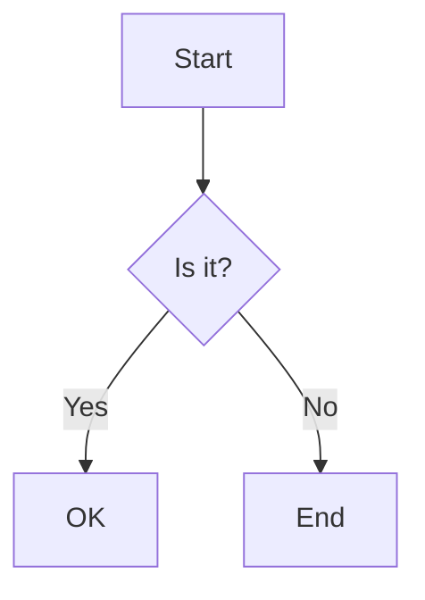
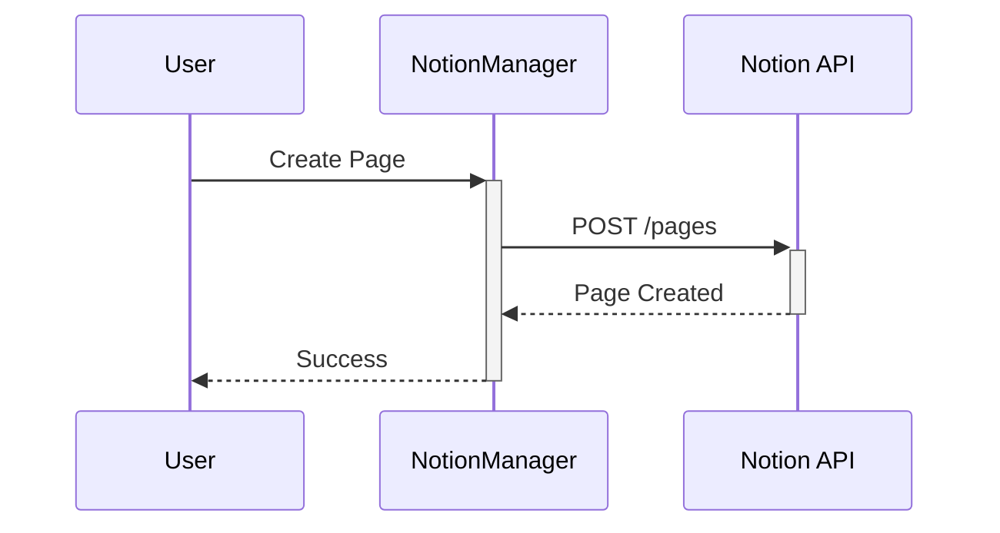
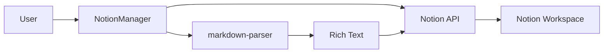
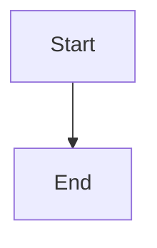
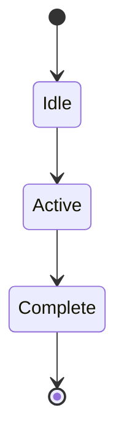
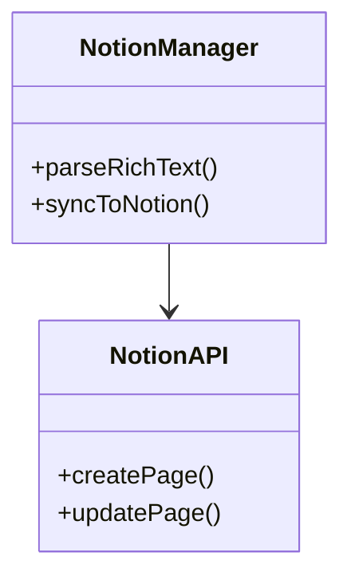
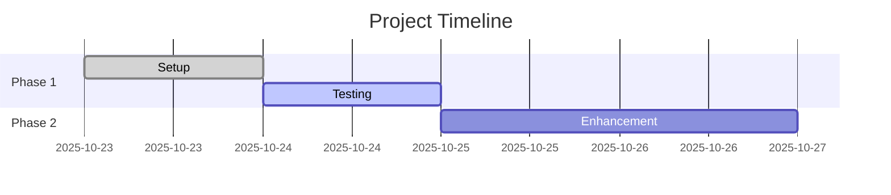

# Complete Formatting Test - All Features

## Test 1: Checklists (To-Do Blocks)

These should appear as actual Notion checkboxes, not bullets:

- [x] Completed task with checkbox
- [x] Another completed item
- [ ] Pending task  (unchecked)
- [ ] Second pending task
- [X] Uppercase X should also work

Expected: 5 Notion to-do blocks (first 2 and last checked, middle 2 unchecked)

---

## Test 2: Dividers

Three hyphens:

---

Three asterisks:

***

Both should create Notion divider blocks (horizontal lines).

---

## Test 3: Tables

Simple table:

| Name | Status | Priority |
|------|--------|----------|
| Task 1 | <green>Complete</green> | High |
| Task 2 | <yellow>In Progress</yellow> | Medium |
| Task 3 | <red>Blocked</red> | Low |

Expected: Table rendered in a code block to preserve formatting.

Complex table with formatting:

| Format | Syntax | Example | Works |
|--------|--------|---------|-------|
| Bold | `**text**` | **bold** | Yes |
| Italic | `*text*` | *italic* | Yes |
| Code | `` `text` `` | `code` | Yes |
| Color | `<red>text</red>` | <red>red</red> | Yes |

Expected: Table in code block.

---

## Test 4: Mermaid Diagrams

Simple flowchart:



Expected: Rendered as mermaid diagram in Notion.

Sequence diagram:



Expected: Rendered as mermaid sequence diagram.

System architecture:



Expected: Rendered as mermaid diagram.

---

## Test 5: Mixed Content

Checklist with formatting:

- [x] **Bold task** completed
- [x] *Italic task* completed
- [ ] `Code task` pending
- [ ] <red>Red task</red> pending
- [ ] __Underlined task__ pending

Expected: 5 to-do blocks with proper formatting within each.

---

## Test 6: All Block Types Together

### Headings Work

Regular **bold** and *italic* text in paragraphs.

- Bullet item
- Another bullet

1. Numbered item
2. Another number

- [x] Checkbox item
- [ ] Unchecked item

> Quote block

`inline code` in text

```javascript
// Code block
const x = 42;
```

***

Table:

| Col1 | Col2 |
|------|------|
| A | B |

---



!> **Important callout**

?> **Info callout**

*> **Note callout**

---

## Test 7: Edge Cases

Empty checklist:
- [ ]

Checklist with special chars:
- [x] Task with **bold** and <red>color</red>
- [ ] Task with [link](https://example.com)

Multiple dividers in a row:

---
***
---

Tables with colors:

| Status | Color |
|--------|-------|
| Active | <green>Green</green> |
| Warning | <yellow>Yellow</yellow> |
| Error | <red>Red</red> |

---

## Test 8: Comprehensive Mermaid Examples

State diagram:



Class diagram:



Gantt chart:



---

## Summary Checklist

Test all these features:

- [x] Basic text formatting (bold, italic, underline, code, strikethrough)
- [x] Colors (9 text + 9 background)
- [x] Links
- [x] Headings (H1, H2, H3)
- [x] Bullets
- [x] Numbered lists
- [ ] **Checklists/To-dos** (FIXED in v2.1)
- [x] Quotes
- [x] Code blocks
- [ ] **Dividers ---** (FIXED in v2.1)
- [ ] **Dividers \*\*\*** (FIXED in v2.1)
- [ ] **Tables** (FIXED in v2.1 - rendered as code blocks)
- [ ] **Mermaid diagrams** (FIXED in v2.1)
- [x] Callouts (!>, ?>, *>)

Expected final result: All checkboxes should be actual Notion to-do blocks, all dividers should be horizontal lines, tables should be in code blocks, and mermaid blocks should render as diagrams.

---

**Version**: 2.1.0 - Bug Fixes
**Date**: 2025-10-23
**Status**: <green_background>Testing Required</green_background>
